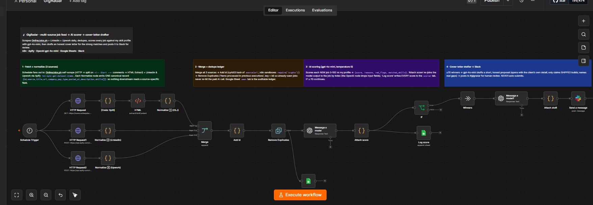
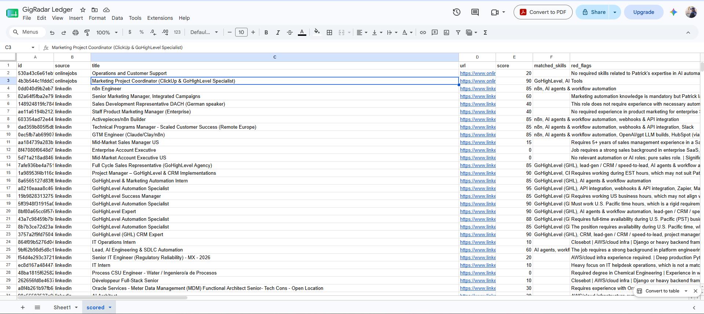

# GigRadar — Multi-Source Job Feed → AI Scorer → Cover-Letter Drafter

**Job hunting is a scraping-and-triage problem wearing a motivation costume.**
GigRadar scrapes three job boards every morning — OnlineJobs.ph, LinkedIn, and Upwork — dedupes
what it's already seen, scores every listing 0–100 against a fixed skill profile with `gpt-4o-mini`,
and for the strong matches drafts a short, honest cover letter — posted to Slack for a human to
review and send.

It never applies to anything on its own. It does the reading, ranking, and first-draft writing;
a person makes every send decision.

> 📖 **[WALKTHROUGH.md](WALKTHROUGH.md)** explains all 21 nodes, line by line.

---

## Why this exists

**The problem —** the useful jobs are spread across boards that each fight scrapers differently,
most listings are noise for any given person, and writing a tailored proposal for each promising
one is the step that quietly doesn't happen when the week gets busy. So good listings scroll past
unseen and the ones that do get a reply get a generic copy-paste.

**The result —** one scheduled run turns three boards into a single ranked feed, filters out the
jobs that don't fit the profile (and says *why* they don't), and hands back a first-draft proposal
for the ones that do — one that opens with the client's own detail and only claims work that's
actually been shipped.

---

## What it does

- **Fetches** from three sources on a schedule: OnlineJobs.ph (self-scraped, free), LinkedIn and
  Upwork (via Apify actors that get past their anti-bot walls).
- **Normalizes** every source into one canonical record
  `{id, source, title, url, company, pay, type, posted_at, description, skills[]}` — so nothing
  downstream ever reads a source-specific field.
- **Dedupes** across runs with a hashed id + n8n's own dedup memory, backed by a Google Sheets
  `seen` ledger. Already-seen jobs never reach the paid AI call. Run it twice — the second run
  scores nothing.
- **Scores** each *new* job 0–100 against the profile with `gpt-4o-mini` (temperature 0), emitting
  `{score, reasons, red_flags, matched_skills}`. Hard-gap tools (Closebot, AWS, deep Python…) land
  in `red_flags` and sink the score. Every score is logged to a `scored` tab for tuning.
- **Gates** at ≥ 70 and **drafts** a cover letter for the winners — short, specific, and bound by
  an honesty rule that only lets it claim shipped work and makes it name real gaps out loud.
- **Posts** each draft to Slack `#gigradar` with the job, score, and apply link. Never auto-submits.

---

## Architecture

One workflow.



```
Schedule Trigger
  ├─ OnlineJobs.ph:  HTTP GET → [Code: split on <!-- Start --> comments] → HTML Extract → Normalize ①
  ├─ LinkedIn:       HTTP POST → Apify run-sync-get-dataset-items → Normalize ②
  └─ Upwork:         HTTP POST → Apify run-sync-get-dataset-items → Normalize ③
        → Merge (append)
        → Add id            (Code: cyrb53 hash of source|url)
        → Remove Duplicates (items processed in previous executions, key = id)
             ├─ Append row in sheet     (Google Sheets: the `seen` ledger)
             └─ Message a model         (gpt-4o-mini, temp 0 → score JSON)
                  → Attach score        (Code: re-join AI output to the job by index)
                       ├─ Log score     (Google Sheets: EVERY score → `scored` tab)
                       └─ IF score >= 70
                             └ true → Winners → Message a model1 (draft)
                                        → Attach draft → Send a message (Slack #gigradar)
```

### The design decisions that matter

| Choice | Why |
|---|---|
| **Canonical record; nothing downstream reads a source-specific field** | Each source has its own Normalize node that emits the same shape. Adding a fourth board is a new adapter, not a rebuild — the same adapter pattern a prospect-sourcing engine would use (swap "job listing" for "ICP" and it's a lead pipeline). |
| **OnlineJobs.ph self-scraped; LinkedIn + Upwork via Apify** | OLJ has weak bot protection, so scraping it in-workflow is free. LinkedIn/Upwork sit behind Cloudflare — Apify is what you pay for to clear that wall. Spend tracks results-saved, so the paid sources are the only ones that cost. |
| **Split the OLJ HTML on `<!-- Start -->` comments, not cheerio** | Each job card is fenced by HTML comments. Splitting on them avoids needing `NODE_FUNCTION_ALLOW_EXTERNAL=cheerio` on the n8n host. |
| **`id` = a pure-JS cyrb53 hash, not `require('crypto')`** | n8n sandboxes Node's built-in modules in Code nodes. A hand-rolled hash gives a stable 16-char id with no import. |
| **Dedup with n8n's native node + a Sheets *audit* ledger** | `Remove Duplicates` ("items processed in previous executions") keyed on the id is the mechanism; the `seen` sheet is the human-readable record. Crucially, dedup runs **before** the AI, so already-seen jobs never cost an OpenAI call. |
| **`Attach score` re-joins the model output to the job by index** | The OpenAI node returns only its own response and drops the input fields. A small Code node pairs each response back to its job (`$('Remove Duplicates').all()[i]`). The parsed JSON lands at `output[0].content[0].text`. |
| **Temperature 0 on the scorer** | Scores have to be comparable across runs. At default temperature the same job drifted across the 70 line between runs; at 0 it's stable. |
| **Score only NEW jobs** | The scorer hangs off the *deduped* stream, not the raw fetch — so a daily run only pays to score what it hasn't seen. |
| **An honesty rule baked into the drafter** | The cover-letter prompt may only reference shipped builds and must name gaps openly instead of faking them. A proposal that admits "I haven't used Meta Pixel, but…" beats one that quietly overclaims. |
| **Never auto-submit** | Drafts go to Slack for review. The machine reads, ranks, and writes; the human decides what actually gets sent. |

---

## Tech stack

- **n8n** (self-hosted) — orchestration
- **Apify** — LinkedIn (`harvestapi/linkedin-job-search`) + Upwork (`chronometrica/upwork-job-scraper`) actors, no-cookie
- **OpenAI `gpt-4o-mini`** — scoring + cover-letter drafting
- **Google Sheets** — the `seen` dedup ledger + the `scored` audit log
- **Slack** — where the ranked jobs + drafts land for review

---

## Setup

1. **Apify token.** Create one at [apify.com](https://apify.com) → Settings → Integrations.
   The two paid sources call `https://api.apify.com/v2/acts/<actor>/run-sync-get-dataset-items`
   with `?token=YOUR_APIFY_TOKEN`. Keep pulls small while testing (`maxItems: 5`) — Apify bills
   per result saved, and the free $5 credit can't overspend without a card on file.
   > When you add a card for real daily runs, set an Apify **monthly spending cap** the same day.

2. **Google Sheet.** Create one and add two tabs:
   - `seen` — header row `id | source | title | url | seen_at`
   - `scored` — header row `id | source | title | url | score | matched_skills | red_flags | reasons | scored_at`

   Set it on the `Append row in sheet` and `Log score` nodes (replacing `YOUR_SHEET_ID`).

3. **Slack.** Create a channel (e.g. `#gigradar`), invite your Slack app/bot, and point the
   `Send a message` node at it. If the channel picker shows no results, the bot is missing
   `channels:read` — select the channel **By ID** instead.

4. **OpenAI credential** in n8n for the two `Message a model` nodes (`gpt-4o-mini`).

5. **Tune the two prompts** to your own profile — they live in
   [`prompts/scoring-prompt.txt`](prompts/scoring-prompt.txt) and
   [`prompts/cover-letter-prompt.txt`](prompts/cover-letter-prompt.txt). The scoring prompt is
   where you set which skills score high and which tools are hard gaps.

6. **Import the workflow:** [`workflows/gigradar.json`](workflows/gigradar.json).

---

## Results & highlights

- **Dedup proven by running it twice** — first run scored a full batch; the second run, unchanged,
  kept **0** (every id already in the ledger) and made **zero** OpenAI calls.
- **The scorer discriminates the way you'd want** — GoHighLevel + API-integration roles landed at
  **95**, n8n roles at **85**, while backend/Closebot/AWS-heavy roles scored **10–25** with those
  exact tools called out in `red_flags`.
- **The drafts are honest and specific** — one opened *"You need expertise in AI automation and
  data analysis using Make and Meta Pixel…"* (the client's own tools), picked up their "Adelaide
  business hours" from the post, and openly flagged the Meta Pixel gap instead of bluffing it.

The `scored` ledger from a real run — every job logged with its score, matched skills, and red flags:



---

## Security notes

- **No secrets in this repo.** The Apify token and Google Sheet ID are scrubbed to
  `YOUR_APIFY_TOKEN` / `YOUR_SHEET_ID`; n8n exports *reference* credentials by name, never keys.
- **No scraped job data.** The exported JSON is the pipeline, not its output — listings live only
  in the source boards and your own Sheet.

---

## Roadmap

- **Public job gallery** — a read-only front-end (Next.js + Supabase) that shows each listing with
  a plain-English AI summary + a suggested-workflow breakdown, filterable by tool.
- **Browserbase sourcing adapter** — run the fragile scrapes on a cloud browser instead of Apify,
  behind the same canonical record (an adapter swap, not a rebuild).
- **Same engine, different target** — swap "job listing" for "ICP" and the exact adapter → score →
  draft pipeline becomes a cold-prospect sourcing + outreach engine.

---

## License

MIT — see `LICENSE` (add your preferred license file).
