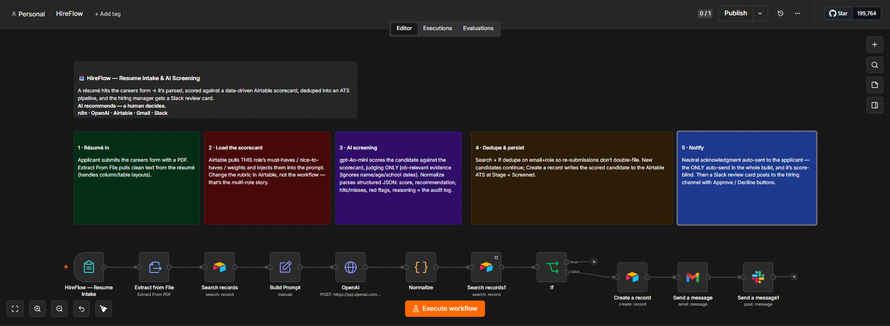
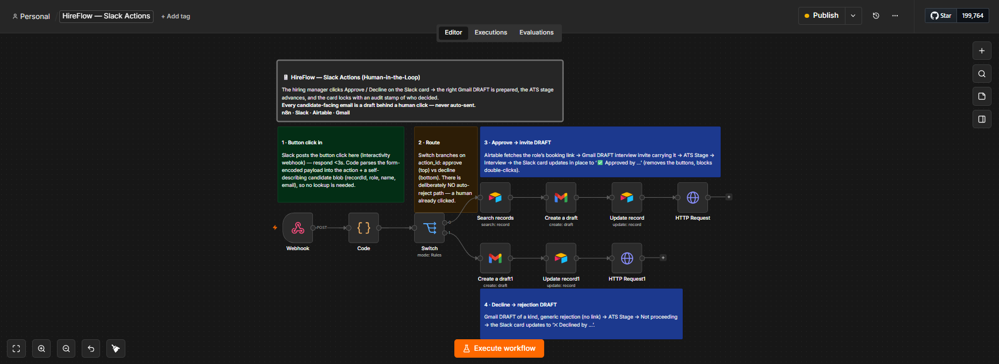
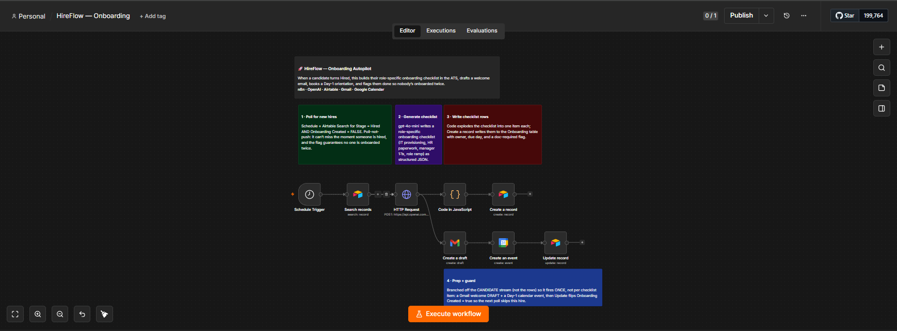
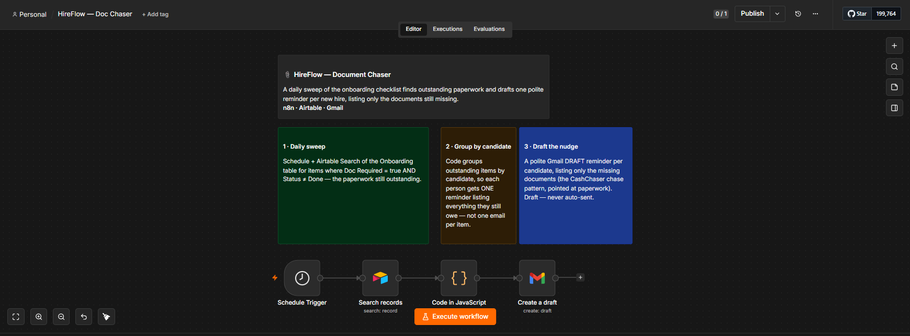
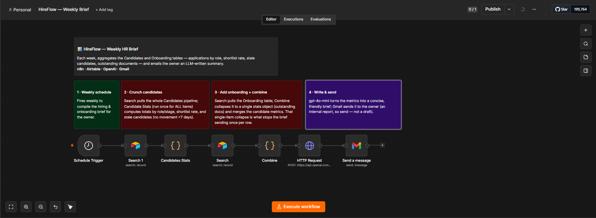

# HireFlow — AI Hiring & Onboarding Ops Autopilot

Careers inbox → **AI-screened candidate** → **human-approved** interview/rejection drafts → **onboarding autopilot** → **weekly HR brief**. Five n8n workflows that run the whole hire-to-onboarded lifecycle for a small team, without the office manager drowning in résumés or ghosting candidates.

**▶ [Watch the demo](https://www.loom.com/share/d8cd666fdcd94a1980e687b8ac700dc5)** — résumé in, Slack review card, one click, draft out.

> **Built as decision *support*, never a decision *maker*.**
> AI hiring tools are regulated (NYC Local Law 144; the EU AI Act treats hiring AI as high-risk). HireFlow is designed around that from the first node:
> - The AI **ranks candidates for human review**. It can auto-send only the neutral "we received your application" acknowledgment. **Every interview invite and every rejection is a Gmail draft behind a human click** — there is deliberately **no auto-reject path anywhere in the system.**
> - The screening prompt is instructed to judge **only job-relevant evidence** and explicitly ignore name, age signals, graduation dates, address, and nationality — scoring against the role's must-haves/nice-to-haves only.
> - **Every AI score and its full reasoning is written to the candidate's Airtable record** = a built-in audit log.
>
> The house rule: **AI recommends, a human decides.**

---

## What it does

| # | Workflow | Trigger | What happens |
|---|----------|---------|--------------|
| 1 | **Resume Intake & Screening** (`resume-intake.json`) | Careers form | Extract résumé text → load the role's Airtable scorecard → gpt-4o-mini scores the candidate (job-relevant evidence only) → dedupe → write to the ATS at Stage = Screened → auto-send a neutral acknowledgment → post a Slack review card with Approve/Decline buttons |
| 2 | **Slack Actions** (`slack-actions.json`) | Slack button click | Parse the click → **Approve** → Gmail **draft** interview invite with the role's booking link + Stage → Interview; **Decline** → Gmail **draft** rejection + Stage → Not proceeding → the Slack card updates in place with an audit stamp of who decided |
| 3 | **Onboarding Autopilot** (`onboarding.json`) | Schedule (poll) | Finds newly-**Hired** candidates → gpt-4o-mini generates a role-specific onboarding checklist → writes it to the Onboarding table → drafts a welcome email + books a Day-1 calendar event → flags the hire so nobody is onboarded twice |
| 4 | **Document Chaser** (`doc-chaser.json`) | Schedule (daily) | Sweeps the onboarding checklist for outstanding paperwork and drafts **one** polite reminder per new hire, listing only the documents still missing |
| 5 | **Weekly HR Brief** (`weekly-brief.json`) | Schedule (weekly) | Aggregates the Candidates + Onboarding tables (applications by role, shortlist rate, stale candidates, outstanding documents) → gpt-4o-mini writes a concise brief → emails the owner |

See **[WALKTHROUGH.md](WALKTHROUGH.md)** for the node-by-node tour.

## Stack

**n8n** (self-hosted) · **OpenAI** `gpt-4o-mini` (structured outputs) · **Airtable** as the ATS (Roles / Candidates / Onboarding) · **Gmail** · **Slack** (interactive Block Kit) · **Google Calendar**

## Setup

1. **Airtable** — create a base with three tables: **Roles** (Role Title, Status, Must-haves, Nice-to-haves, Hiring Manager, Booking Link), **Candidates** (Name, Email, Role, Score, Recommendation, Stage, plus AI reasoning/audit fields and an `Onboarding Created` checkbox), **Onboarding** (Checklist Item, Candidate, Email, Role, Owner, Due Day, Status, Doc Required).
2. Replace the placeholders in the workflow JSON with your own ids: `YOUR_AIRTABLE_BASE_ID`, `YOUR_ROLES_TABLE_ID`, `YOUR_CANDIDATES_TABLE_ID`, `YOUR_ONBOARDING_TABLE_ID`, `YOUR_SLACK_CHANNEL_ID`, and the owner address `you@example.com`.
3. **Credentials** (referenced, never included): Airtable PAT, OpenAI API, Gmail OAuth2, Slack (bot token with `chat:write`), Google Calendar OAuth2.
4. **Slack app** — a dedicated app with `chat:write`, and **Interactivity** turned **on** (Socket Mode **off**) with its Request URL pointed at the Slack Actions webhook. The button `value` carries the candidate's record id + role + email so the callback is self-describing.
5. Import each workflow; re-select credentials; set your schedule intervals.

### Hardening notes
- The Slack Actions webhook does not yet verify Slack's request signature. For production, add an HMAC check on `X-Slack-Signature` / `X-Slack-Request-Timestamp` before acting on a payload.
- The onboarding "Due Day" is a label (Day 1 / Week 1 / Month 1); add a real due-date field for true overdue-only document chasing.

## Screenshots

### 1 · Resume Intake & Screening

### 2 · Slack Actions (Human-in-the-Loop)

### 3 · Onboarding Autopilot

### 4 · Document Chaser

### 5 · Weekly HR Brief

